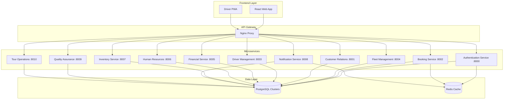
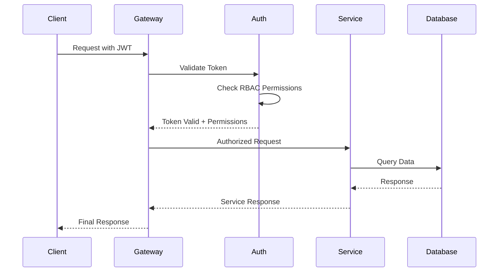

# 🚌 Moroccan Tourist Transport ERP System

[](https://github.com/ezzimo/moroccan-tourist-transport-erp)
[](LICENSE)
[](https://github.com/ezzimo/moroccan-tourist-transport-erp/releases)

> **Transform your tourist transport operations with Morocco's most comprehensive ERP solution** — streamlining fleet management, bookings, customer relations, and compliance in one unified platform.

## Table of Contents

- [Project Overview](#project-overview)
- [Architecture](#architecture)
- [Feature Deep-Dive](#feature-deep-dive)
- [Quick Start](#quick-start)
- [Full Setup & Development Guide](#full-setup--development-guide)
- [Deployment](#deployment)
- [API Documentation](#api-documentation)
- [User Guides](#user-guides)
- [Compliance & Security](#compliance--security)
- [Roadmap](#roadmap)
- [Screenshots & Demo](#screenshots--demo)
- [FAQ & Support](#faq--support)

## Project Overview

The **Moroccan Tourist Transport ERP System** is a comprehensive enterprise resource planning solution specifically designed for Morocco's tourism transportation industry. Built with modern microservices architecture, it delivers real-time operational control, regulatory compliance, and exceptional customer experiences.

### 🎯 Key Business Benefits

- **📈 Revenue Growth**: Optimize pricing, reduce no-shows, and maximize fleet utilization
- **⚡ Operational Efficiency**: Automate dispatching, route planning, and resource allocation
- **🛡️ Regulatory Compliance**: Built-in Morocco transport regulations and GDPR compliance
- **📱 Mobile-First**: Progressive Web App for drivers and real-time passenger updates
- **💰 Cost Reduction**: Predictive maintenance, fuel optimization, and automated reporting
- **🌟 Customer Satisfaction**: Seamless booking experience and real-time communication

### 👥 Target User Groups

- **🏢 Operations Managers**: Fleet oversight, performance analytics, compliance monitoring
- **📋 Dispatchers**: Real-time booking management, driver coordination, route optimization
- **🚗 Drivers**: Mobile app for trip management, navigation, customer communication
- **💼 Finance Teams**: Revenue tracking, expense management, automated invoicing
- **👨‍💼 Administrators**: User management, system configuration, security oversight
- **🏨 Tourism Partners**: Hotel integrations, tour operator collaborations

## Architecture

### System Architecture Diagram



### 🏗️ Microservices Overview

| Service | Port | Responsibility | Database |
|---------|------|----------------|----------|
| **Authentication** | 8000 | JWT tokens, RBAC, user sessions, OTP verification | `auth_db` |
| **Customer Relations** | 8001 | Customer profiles, preferences, communication history | `crm_db` |
| **Booking Management** | 8002 | Reservations, availability, pricing, cancellations | `booking_db` |
| **Driver Management** | 8003 | Driver profiles, schedules, performance, mobile app | `driver_db` |
| **Fleet Management** | 8004 | Vehicle tracking, maintenance, fuel, GPS integration | `fleet_db` |
| **Financial Service** | 8005 | Invoicing, payments, revenue analytics, expense tracking | `financial_db` |
| **Human Resources** | 8006 | Employee management, payroll, scheduling, performance | `hr_db` |
| **Inventory Service** | 8007 | Parts management, maintenance supplies, procurement | `inventory_db` |
| **Notifications** | 8008 | SMS, email, push notifications, communication logs | `notification_db` |
| **Quality Assurance** | 8009 | Service ratings, feedback analysis, improvement tracking | `qa_db` |
| **Tour Operations** | 8010 | Tour packages, itineraries, guide management, partnerships | `tour_db` |

### 🛠️ Technology Stack & Rationale

**Backend Architecture**
- **FastAPI**: High-performance async Python framework with automatic OpenAPI documentation
- **SQLModel**: Type-safe database operations with Pydantic integration
- **PostgreSQL**: ACID-compliant relational database with excellent JSON support
- **Redis**: High-performance caching and session management
- **Docker**: Containerized deployment with service isolation

**Frontend Architecture**
- **React 18**: Modern component-based UI with concurrent features
- **TypeScript**: Type safety and enhanced developer experience
- **Vite**: Lightning-fast development and optimized production builds
- **TanStack Query**: Powerful data fetching and caching
- **Tailwind CSS**: Utility-first styling with responsive design

**Infrastructure**
- **Docker Compose**: Local development orchestration
- **Nginx**: Reverse proxy and load balancing
- **Health Checks**: Service monitoring and automatic recovery

### 🔐 Security Architecture



- **JWT Authentication**: Stateless token-based authentication with refresh tokens
- **Role-Based Access Control (RBAC)**: Granular permissions for different user types
- **HTTPS Everywhere**: TLS encryption for all client-server communication
- **API Gateway Security**: Centralized authentication and rate limiting
- **Database Security**: Connection pooling, prepared statements, encryption at rest

## Feature Deep-Dive

### 🚗 Fleet Management

- **Real-time Vehicle Tracking**: GPS integration with live location updates
- **Predictive Maintenance**: Automated scheduling based on mileage and time intervals
- **Fuel Management**: Consumption tracking, cost analysis, and optimization recommendations
- **Vehicle Lifecycle**: From acquisition to disposal with depreciation calculations
- **Compliance Monitoring**: Insurance, registration, and safety inspection tracking
- **Performance Analytics**: Utilization rates, efficiency metrics, and cost per kilometer

### 📅 Booking Management

- **Multi-channel Reservations**: Web, mobile, phone, and partner integrations
- **Dynamic Pricing**: Demand-based pricing with seasonal adjustments
- **Availability Engine**: Real-time seat/vehicle availability across the fleet
- **Booking Workflows**: Confirmation, modification, cancellation with automated notifications
- **Group Bookings**: Special handling for tour groups and corporate clients
- **Payment Integration**: Multiple payment gateways with secure processing

### 👥 Customer Relations (CRM)

- **360° Customer Profiles**: Complete history, preferences, and communication logs
- **Segmentation & Targeting**: Automated customer categorization for marketing
- **Loyalty Programs**: Points, rewards, and tier-based benefits
- **Communication Hub**: Unified SMS, email, and push notification management
- **Feedback Management**: Review collection, sentiment analysis, and response workflows
- **Customer Support**: Ticketing system with escalation and resolution tracking

### 👨‍💼 Human Resources

- **Employee Lifecycle**: Onboarding, performance management, and offboarding
- **Shift Scheduling**: Automated scheduling with availability and skill matching
- **Payroll Integration**: Hours tracking, overtime calculation, and payment processing
- **Training Management**: Certification tracking and compliance requirements
- **Performance Analytics**: KPI tracking, goal setting, and review processes
- **Document Management**: Contracts, certifications, and compliance documents

### 💰 Financial Management

- **Revenue Analytics**: Real-time revenue tracking with forecasting
- **Automated Invoicing**: Customer billing with payment tracking
- **Expense Management**: Fuel, maintenance, and operational cost tracking
- **Profitability Analysis**: Route-level and vehicle-level profit margins
- **Tax Compliance**: Moroccan tax regulations with automated reporting
- **Financial Reporting**: P&L, cash flow, and custom business intelligence dashboards

### 📦 Inventory Management

- **Parts Catalog**: Comprehensive database of vehicle parts and supplies
- **Stock Management**: Real-time inventory levels with automatic reordering
- **Supplier Relations**: Vendor management with performance tracking
- **Maintenance Integration**: Parts consumption tracking for maintenance activities
- **Cost Optimization**: Bulk purchasing recommendations and cost analysis
- **Audit Trail**: Complete history of inventory movements and adjustments

### ⭐ Quality Assurance

- **Service Rating System**: Customer feedback collection and analysis
- **Performance Monitoring**: Service quality metrics and trend analysis
- **Incident Management**: Issue tracking, root cause analysis, and resolution
- **Compliance Auditing**: Regular checks against service standards
- **Improvement Tracking**: Action items and improvement initiative monitoring
- **Benchmarking**: Performance comparison against industry standards

### 🗺️ Tour Operations

- **Package Management**: Tour creation, pricing, and itinerary planning
- **Guide Assignment**: Tour guide scheduling and performance tracking
- **Partner Integration**: Hotel, restaurant, and attraction partnerships
- **Route Optimization**: Efficient routing for multi-stop tours
- **Capacity Management**: Group size optimization and resource allocation
- **Revenue Optimization**: Dynamic pricing and upselling opportunities

### 🚗 Driver Management

- **Driver Profiles**: Complete records with licenses, certifications, and performance
- **Mobile Application**: Trip management, navigation, and customer communication
- **Schedule Management**: Shift planning with availability and preference matching
- **Performance Tracking**: Safety scores, customer ratings, and efficiency metrics
- **Training & Certification**: Ongoing education and compliance requirements
- **Incentive Programs**: Performance-based rewards and recognition

### 🔔 Notification System

- **Multi-channel Delivery**: SMS, email, push notifications, and in-app messages
- **Event-driven Triggers**: Automated notifications based on system events
- **Template Management**: Customizable message templates with personalization
- **Delivery Tracking**: Read receipts, delivery confirmations, and failure handling
- **Preference Management**: Customer communication preferences and opt-out handling
- **Analytics & Reporting**: Message performance and engagement metrics

## Quick Start

Get the Moroccan Tourist Transport ERP System running locally in under 5 minutes:

### Prerequisites

- **Docker** & **Docker Compose** (v2.0+)
- **Git**
- **8GB RAM** minimum (16GB recommended)

### 🚀 One-Command Setup

```bash
# Clone the repository
git clone https://github.com/ezzimo/moroccan-tourist-transport-erp.git
cd moroccan-tourist-transport-erp

# Start all services (this will take 3-5 minutes on first run)
docker compose up -d --build

# Verify all services are healthy
docker compose ps
```

### 🌐 Access the Application

- **Frontend Application**: http://localhost:3000
- **API Documentation**: http://localhost:8000/docs
- **Default Login**: `ahmed@example.com` / `SecurePassword123!`

### ✅ Health Check

```bash
# Check all services are running
curl http://localhost:8000/health

# Expected response:
# {"status":"healthy","database":"connected","redis":"connected"}
```

**Supported Platforms**: Linux, macOS, Windows (WSL2 recommended)

## Full Setup & Development Guide

### 📋 Prerequisites

**Required Software**
- **Docker** (v20.10+) & **Docker Compose** (v2.0+)
- **Node.js** (v18+) & **pnpm** (v8+)
- **Python** (v3.11+) & **pip**
- **Git** (v2.30+)

**System Requirements**
- **CPU**: 4+ cores recommended
- **RAM**: 8GB minimum, 16GB recommended
- **Storage**: 10GB free space
- **Network**: Stable internet for initial setup

### 🔧 Environment Configuration

<details>
<summary>Backend Services Environment Variables</summary>

Each microservice requires its own `.env` file:

**Authentication Service** (`backend/app/.env`):
```env
DATABASE_URL=postgresql://postgres:password@db_auth:5432/auth_db
REDIS_URL=redis://redis_auth:6379
SECRET_KEY=your-super-secret-jwt-key
ALGORITHM=HS256
ACCESS_TOKEN_EXPIRE_MINUTES=30
REFRESH_TOKEN_EXPIRE_DAYS=7
```

**Other Services**: Copy `.env.example` to `.env` in each service directory and customize as needed.
</details>

<details>
<summary>Frontend Environment Variables</summary>

**Frontend** (`frontend/.env`):
```env
VITE_API_BASE_URL=/api/v1
VITE_APP_NAME=Moroccan Tourist Transport ERP
VITE_APP_VERSION=1.0.0
```
</details>

### 🗄️ Database Setup

```bash
# Initialize all databases with migrations
docker compose exec auth_service alembic upgrade head
docker compose exec booking_service alembic upgrade head
docker compose exec fleet_service alembic upgrade head
# ... repeat for all services

# Create test data (optional)
python create_test_user.py
```

### 💻 Development Workflow

**Backend Development**:
```bash
# Install Python dependencies
cd backend/app
pip install -r requirements.txt

# Run service locally (with hot reload)
uvicorn main:app --reload --host 0.0.0.0 --port 8000

# Run tests
pytest tests/ -v

# Database migrations
alembic revision --autogenerate -m "Description"
alembic upgrade head
```

**Frontend Development**:
```bash
# Install dependencies
cd frontend
pnpm install

# Start development server
pnpm dev

# Run tests
pnpm test

# Build for production
pnpm build
```

### 🧪 Testing Commands

**Backend Testing**:
```bash
# Run all tests with coverage
pytest --cov=app tests/

# Run specific test file
pytest tests/test_auth.py -v

# Run integration tests
pytest tests/integration/ -v
```

**Frontend Testing**:
```bash
# Run unit tests
pnpm test

# Run E2E tests
pnpm test:e2e

# Visual regression tests
pnpm test:visual
```

## Deployment

### 🚀 Production Deployment

The system is designed for cloud-native deployment with Kubernetes:

<details>
<summary>Kubernetes Deployment</summary>

```yaml
# Example Helm values for production
replicaCount: 3
image:
  repository: your-registry/moroccan-erp
  tag: "1.0.0"
  
ingress:
  enabled: true
  className: nginx
  hosts:
    - host: erp.yourdomain.com
      paths:
        - path: /
          pathType: Prefix
          
resources:
  limits:
    cpu: 1000m
    memory: 2Gi
  requests:
    cpu: 500m
    memory: 1Gi
```

Deploy with:
```bash
helm install moroccan-erp ./helm-chart -f values-production.yaml
```
</details>

### 📊 Monitoring & Observability

**Monitoring Stack**:
- **Prometheus**: Metrics collection and alerting
- **Grafana**: Visualization dashboards and analytics
- **Loki**: Centralized logging and log analysis
- **Jaeger**: Distributed tracing for microservices

**Key Metrics Monitored**:
- API response times and error rates
- Database connection pools and query performance
- Memory and CPU utilization per service
- Business metrics (bookings, revenue, fleet utilization)

### 💾 Backup & Disaster Recovery

**Automated Backup Strategy**:
```bash
# Daily PostgreSQL backups
pg_dump auth_db > backups/auth_db_$(date +%Y%m%d).sql

# Redis persistence configuration
redis-cli BGSAVE

# File system backups (uploads, logs)
rsync -av /app/uploads/ /backup/uploads/
```

**Recovery Procedures**:
- **RTO (Recovery Time Objective)**: < 4 hours
- **RPO (Recovery Point Objective)**: < 1 hour
- **Multi-region deployment** for high availability
- **Automated failover** with health checks

## API Documentation

### 📚 Interactive API Documentation

- **Swagger UI**: http://localhost:8000/docs
- **ReDoc**: http://localhost:8000/redoc
- **OpenAPI Spec**: http://localhost:8000/openapi.json

### 🔐 Authentication Endpoints

**Login**:
```bash
curl -X POST "http://localhost:8000/api/v1/auth/login" \
  -H "Content-Type: application/json" \
  -d '{
    "email": "ahmed@example.com",
    "password": "SecurePassword123!"
  }'
```

**Response**:
```json
{
  "access_token": "eyJhbGciOiJIUzI1NiIsInR5cCI6IkpXVCJ9...",
  "token_type": "bearer",
  "expires_in": 3600,
  "user": {
    "id": "uuid",
    "email": "ahmed@example.com",
    "role": "admin"
  }
}
```

### 📝 Error Handling

**Standard Error Response**:
```json
{
  "error": {
    "code": "VALIDATION_ERROR",
    "message": "Invalid input data",
    "details": {
      "field": "email",
      "issue": "Invalid email format"
    }
  }
}
```

### 🔄 API Versioning

- **Current Version**: v1
- **Versioning Strategy**: URL path versioning (`/api/v1/`)
- **Backward Compatibility**: Maintained for 2 major versions
- **Deprecation Policy**: 6-month notice for breaking changes

## User Guides

### 👨‍💼 Administrator Guide

**Initial System Setup**:
1. **User Management**: Create roles and assign permissions
2. **Fleet Configuration**: Add vehicles and set up maintenance schedules
3. **Pricing Setup**: Configure base rates and dynamic pricing rules
4. **Integration Setup**: Connect payment gateways and external APIs

**Daily Operations**:
- Monitor system health via dashboards
- Review and approve booking modifications
- Manage user access and permissions
- Generate operational reports

### 📋 Dispatcher Workflow

**Morning Routine**:
1. **Fleet Status Check**: Review vehicle availability and driver schedules
2. **Booking Review**: Confirm today's reservations and identify conflicts
3. **Route Optimization**: Plan efficient routes for multiple bookings
4. **Driver Assignment**: Match drivers to vehicles and routes

**Real-time Operations**:
- Monitor live bookings and availability
- Handle customer service requests
- Coordinate with drivers for schedule changes
- Manage emergency situations and rebooking

### 🚗 Driver Mobile App

**Getting Started**:
1. **Download PWA**: Access via mobile browser at your company's URL
2. **Login**: Use credentials provided by your dispatcher
3. **Profile Setup**: Complete driver profile and preferences

**Daily Usage**:
- **Check Schedule**: View assigned trips and routes
- **Navigate**: Integrated GPS navigation for optimal routes
- **Customer Communication**: In-app messaging and calling
- **Trip Management**: Start/end trips, collect payments, report issues

## Compliance & Security

### 🇲🇦 Moroccan Transport Regulations

**Regulatory Compliance**:
- **Ministry of Transport**: Vehicle registration and inspection requirements
- **Driver Licensing**: Professional driver certification tracking
- **Safety Standards**: Regular safety inspections and maintenance records
- **Insurance Requirements**: Comprehensive coverage verification
- **Route Permits**: Tourist route authorization and compliance

**Automated Compliance Features**:
- Expiration date tracking for licenses and permits
- Automated renewal reminders
- Compliance reporting for regulatory authorities
- Audit trail for all regulatory interactions

### 🌍 GDPR Compliance for EU Tourists

**Data Protection Measures**:
- **Consent Management**: Clear opt-in/opt-out for data processing
- **Data Minimization**: Collect only necessary customer information
- **Right to Access**: Customer data export functionality
- **Right to Erasure**: Secure data deletion upon request
- **Data Portability**: Standard format data exports
- **Breach Notification**: Automated alerts for security incidents

### 🛡️ OWASP Top 10 Security Mitigations

| OWASP Risk | Mitigation Strategy |
|------------|-------------------|
| **Injection** | Parameterized queries, input validation, SQLModel ORM |
| **Broken Authentication** | JWT with refresh tokens, MFA, session management |
| **Sensitive Data Exposure** | TLS encryption, data masking, secure storage |
| **XML External Entities** | JSON-only APIs, XML parsing disabled |
| **Broken Access Control** | RBAC implementation, principle of least privilege |
| **Security Misconfiguration** | Automated security scanning, hardened containers |
| **Cross-Site Scripting** | Content Security Policy, input sanitization |
| **Insecure Deserialization** | JSON schema validation, secure serialization |
| **Known Vulnerabilities** | Automated dependency scanning, regular updates |
| **Insufficient Logging** | Comprehensive audit logs, security monitoring |

### 📋 ISO Standards Alignment

**ISO 9001 (Quality Management)**:
- Documented processes and procedures
- Customer satisfaction measurement
- Continuous improvement workflows
- Management review processes

**ISO 27001 (Information Security)**:
- Information security management system
- Risk assessment and treatment
- Security incident management
- Business continuity planning

## Roadmap

### 🎯 Next Quarter (Q1 2025)

**Core Features**:
- [ ] **Mobile Driver App**: Native iOS/Android applications
- [ ] **Advanced Analytics**: Machine learning-powered insights
- [ ] **Multi-language Support**: Arabic, French, English interfaces
- [ ] **Payment Gateway Integration**: Local Moroccan payment methods

**Technical Improvements**:
- [ ] **Kubernetes Migration**: Production-ready container orchestration
- [ ] **API Rate Limiting**: Advanced throttling and quotas
- [ ] **Real-time Notifications**: WebSocket-based live updates
- [ ] **Automated Testing**: Comprehensive E2E test suite

### 🚀 Medium-term Goals (Q2-Q3 2025)

**Business Features**:
- [ ] **Partner Portal**: Hotel and tour operator integrations
- [ ] **Dynamic Pricing AI**: Machine learning-based pricing optimization
- [ ] **Predictive Maintenance**: IoT sensor integration for vehicles
- [ ] **Customer Mobile App**: Self-service booking and management

**Platform Enhancements**:
- [ ] **Multi-tenant Architecture**: Support for multiple transport companies
- [ ] **Advanced Reporting**: Custom dashboard builder
- [ ] **Integration Hub**: Third-party service connectors
- [ ] **Offline Capability**: Progressive Web App offline functionality

### 🌟 Long-term Vision (2025-2026)

**Innovation Features**:
- [ ] **AI-Powered Route Optimization**: Traffic and demand prediction
- [ ] **Blockchain Integration**: Secure, transparent transaction records
- [ ] **IoT Fleet Management**: Real-time vehicle telemetry
- [ ] **Augmented Reality**: AR navigation for drivers

**Market Expansion**:
- [ ] **Regional Expansion**: Support for other North African countries
- [ ] **White-label Solution**: Customizable for different transport companies
- [ ] **API Marketplace**: Third-party developer ecosystem
- [ ] **SaaS Platform**: Cloud-hosted multi-tenant solution

### 🤝 Community Contributions

We welcome contributions from the community! Here's how you can help:

**Development Contributions**:
- **Bug Reports**: Use GitHub Issues with detailed reproduction steps
- **Feature Requests**: Propose new features with business justification
- **Code Contributions**: Follow our coding standards and submit PRs
- **Documentation**: Help improve guides and API documentation

**Getting Started with Contributions**:
1. Fork the repository
2. Create a feature branch (`git checkout -b feature/amazing-feature`)
3. Commit your changes (`git commit -m 'Add amazing feature'`)
4. Push to the branch (`git push origin feature/amazing-feature`)
5. Open a Pull Request

## Screenshots & Demo

### 🖼️ Application Screenshots

> **Note**: Screenshots will be added as the application UI is finalized. The following are placeholder descriptions for the main interfaces:

**Dashboard Overview**

*Main operational dashboard showing fleet status, active bookings, and key performance indicators*

**Booking Management**

*Comprehensive booking interface with calendar view, customer details, and payment status*

**Fleet Tracking**

*Real-time map view of vehicle locations with route optimization and driver status*

**Driver Mobile Interface**

*Mobile-optimized interface for drivers showing trip details, navigation, and customer communication*

### 🎬 Demo Videos

**System Overview Demo**
- [ ] 5-minute walkthrough of core features
- [ ] Booking process from customer perspective
- [ ] Dispatcher workflow demonstration
- [ ] Driver mobile app usage

**Technical Deep Dive**
- [ ] Architecture explanation and service interactions
- [ ] API demonstration with Postman
- [ ] Database schema and relationships
- [ ] Deployment and scaling demonstration

## FAQ & Support

### ❓ Frequently Asked Questions

<details>
<summary><strong>Q: What are the minimum system requirements?</strong></summary>

**Development Environment**:
- CPU: 4+ cores (Intel i5 or AMD Ryzen 5 equivalent)
- RAM: 8GB minimum, 16GB recommended
- Storage: 10GB free space for Docker images and data
- OS: Linux, macOS, or Windows with WSL2

**Production Environment**:
- CPU: 8+ cores per node
- RAM: 16GB+ per node
- Storage: SSD with 100GB+ for databases
- Network: Stable internet with low latency
</details>

<details>
<summary><strong>Q: How do I reset the admin password?</strong></summary>

```bash
# Using the password reset script
python create_test_user.py --reset-admin

# Or directly in the database
docker compose exec db_auth psql -U postgres -d auth_db
UPDATE users SET password_hash = '$2b$12$...' WHERE email = 'admin@example.com';
```
</details>

<details>
<summary><strong>Q: Can I customize the system for my specific business needs?</strong></summary>

Yes! The system is designed to be highly customizable:
- **Configuration**: Modify business rules via environment variables
- **Theming**: Custom CSS and branding in the frontend
- **Workflows**: Configurable approval processes and notifications
- **Integrations**: REST API for connecting external systems
- **Custom Development**: Full source code access for modifications
</details>

<details>
<summary><strong>Q: What payment gateways are supported?</strong></summary>

Currently supported payment methods:
- **Credit/Debit Cards**: Visa, Mastercard, American Express
- **Local Payment Methods**: Moroccan bank transfers
- **Digital Wallets**: PayPal integration
- **Cash Payments**: Manual recording and reconciliation

*Additional payment gateways can be integrated via the payment service API.*
</details>

<details>
<summary><strong>Q: How do I backup and restore data?</strong></summary>

**Automated Backups**:
```bash
# Database backup
docker compose exec db_auth pg_dump -U postgres auth_db > backup.sql

# Full system backup
docker compose exec auth_service python scripts/backup.py
```

**Restore Process**:
```bash
# Restore database
docker compose exec db_auth psql -U postgres auth_db < backup.sql

# Restore full system
docker compose exec auth_service python scripts/restore.py backup.tar.gz
```
</details>

### 🛠️ Common Setup Issues & Solutions

**Issue: Docker containers fail to start**
```bash
# Solution: Check Docker resources and restart
docker system prune -a
docker compose down
docker compose up -d --build
```

**Issue: Database connection errors**
```bash
# Solution: Verify database health and reset if needed
docker compose logs db_auth
docker compose restart db_auth
```

**Issue: Frontend build failures**
```bash
# Solution: Clear cache and reinstall dependencies
cd frontend
rm -rf node_modules package-lock.json
npm install
npm run build
```

**Issue: Port conflicts**
```bash
# Solution: Check for conflicting services
sudo netstat -tlnp | grep :3000
# Kill conflicting process or change ports in docker-compose.yml
```

### 📞 Support Channels

**Technical Support**:
- **GitHub Issues**: [Report bugs and request features](https://github.com/ezzimo/moroccan-tourist-transport-erp/issues)
- **Documentation**: [Comprehensive guides and API docs](https://docs.moroccan-erp.com)
- **Community Forum**: [Join discussions and get help](https://community.moroccan-erp.com)

**Business Inquiries**:
- **Email**: support@moroccan-erp.com
- **Phone**: +212 5XX-XXX-XXX
- **Business Hours**: Sunday-Thursday, 9:00 AM - 6:00 PM (GMT+1)

**Emergency Support**:
- **24/7 Hotline**: +212 6XX-XXX-XXX (Production issues only)
- **Slack Channel**: #moroccan-erp-support (for enterprise customers)

### 📚 Additional Resources

**Learning Resources**:
- [Video Tutorials](https://youtube.com/moroccan-erp)
- [Best Practices Guide](docs/best-practices.md)
- [API Integration Examples](docs/api-examples.md)
- [Troubleshooting Guide](docs/troubleshooting.md)

**Developer Resources**:
- [Contributing Guidelines](CONTRIBUTING.md)
- [Code Style Guide](docs/code-style.md)
- [Architecture Decision Records](docs/adr/)
- [Development Roadmap](docs/roadmap.md)

---

## 📄 License

This project is licensed under the MIT License - see the [LICENSE](LICENSE) file for details.

## 🙏 Acknowledgments

- **Moroccan Ministry of Transport** for regulatory guidance
- **Open Source Community** for the amazing tools and libraries
- **Beta Testers** from Moroccan transport companies
- **Contributors** who helped shape this system

---

**Built with ❤️ for Morocco's Tourism Industry**

*Last updated: July 26, 2025*

